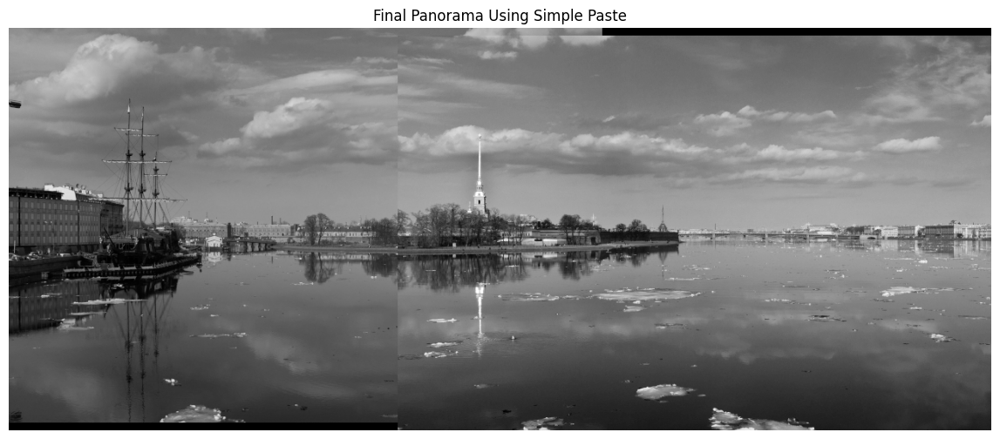
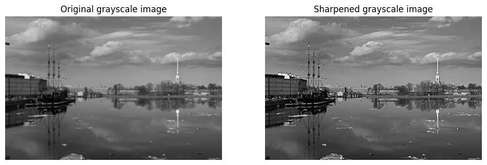
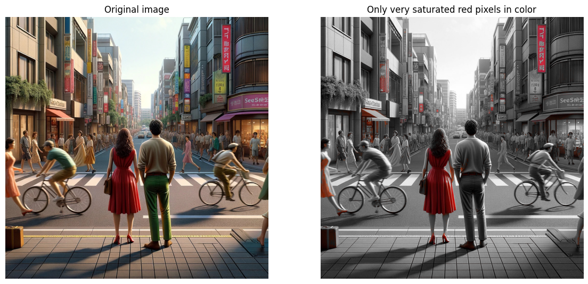

# Image-Processing-Projects

Collection of image processing projects developed as part of the Signal and Image Processing course.

The projects explore fundamental techniques for manipulating digital images, including geometric alignment, intensity correction, spatial filtering and color-space transformations.

## Project Overview

The repository contains three independent image processing projects:

1. **Simple Panoramic Image**
2. **Image Sharpening using a Single Spatial Filter**
3. **Selective Color Rendering**

Each project includes a Jupyter notebook with the complete implementation.

## 1. Simple Panoramic Image

This project creates a simple panoramic image starting from two partially overlapping grayscale images.

The processing pipeline includes:

- Image loading and grayscale conversion
- Manual horizontal and vertical translation
- Visual alignment using common image features
- Gamma correction for brightness adjustment
- Image merging on a larger canvas
- Final panorama generation

The best manual alignment was obtained using:

- `x_offset = 510`
- `y_offset = 10`

Gamma correction was then applied to reduce brightness differences between the two input images before merging.

The project demonstrates how images can be manipulated as numerical arrays using geometric transformations and pixel-level operations.

### Project Materials

- **Project Notebook:** Complete implementation of image alignment, gamma correction and panorama creation. [Open notebook](Panoramic-Image/panoramic_image.ipynb)

## 2. Image Sharpening using a Single Spatial Filter

This project designs and applies a spatial sharpening filter to enhance edges and fine image details.

The sharpening filter is constructed by combining:

- A Gaussian smoothing filter
- An identity filter

The final sharpening filter follows the formulation:

`h_sharpen = h_identity + (h_identity - h_gaussian)`

The workflow includes:

- Image conversion to grayscale
- Gaussian filter construction
- Identity filter construction
- Sharpening filter generation
- Spatial convolution
- Visual comparison between original and sharpened images
- Difference-image analysis

A `7 × 7` Gaussian filter with `sigma = 1.2` is used to obtain a moderate sharpening effect while preserving a natural appearance.

The result shows clearer edges and fine structures, particularly around buildings, the ship, reflections and other high-frequency regions.

### Project Materials

- **Project Notebook:** Full implementation of the spatial sharpening pipeline. [Open notebook](Image-Sharpening/image_sharpening.ipynb)

## 3. Selective Color Rendering

This project creates a selective color effect in which red regions remain colored while the rest of the image is converted to grayscale.

The workflow includes:

- RGB image loading
- Conversion from RGB to HSV color space
- Definition of a red-color mask
- Extraction of red regions
- Grayscale conversion of the remaining image
- Combination of grayscale and colored regions

HSV space is used because it provides a more convenient representation for isolating specific colors based on hue.

The final image preserves red regions while converting all other areas to grayscale, demonstrating the use of color-space transformations and masking techniques.

### Project Materials

- **Project Notebook:** Complete selective color rendering implementation. [Open notebook](Selective-Color-Rendering/selective_color_rendering.ipynb)

## Tech Stack

**Language**

- Python

**Libraries**

- NumPy
- Matplotlib
- scikit-image
- SciPy

**Methods**

- Image Alignment
- Image Translation
- Gamma Correction
- Image Merging
- Spatial Filtering
- Gaussian Filtering
- Image Sharpening
- Convolution
- RGB to HSV Conversion
- Color Masking
- Grayscale Conversion

## Author

Irene Marrali

BSc in Artificial Intelligence @ Università degli Studi di Milano, Università degli Studi di Pavia, Università degli Studi di Milano-Bicocca

